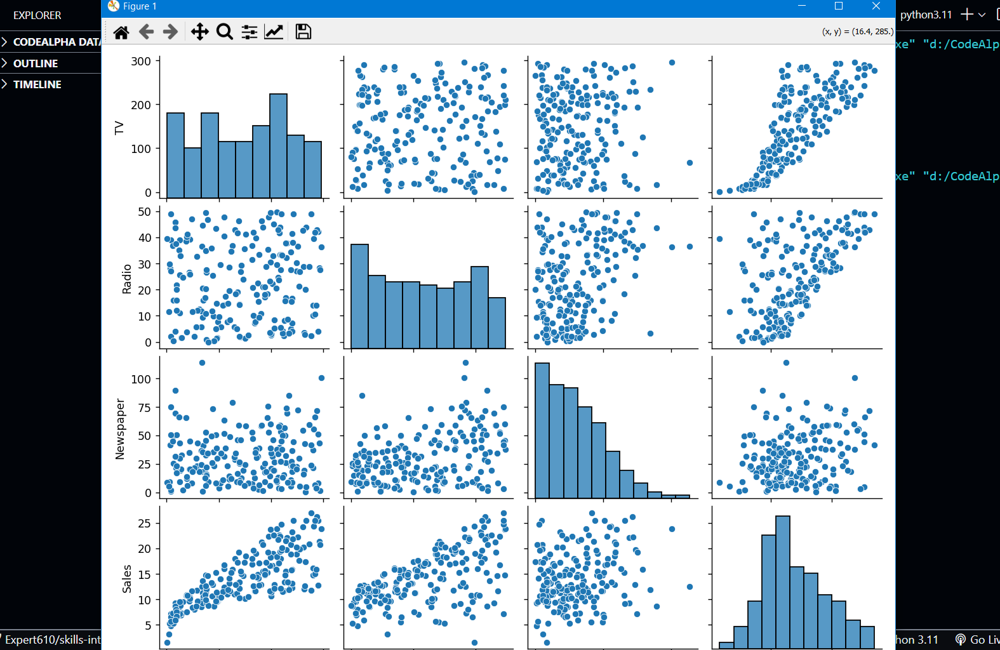
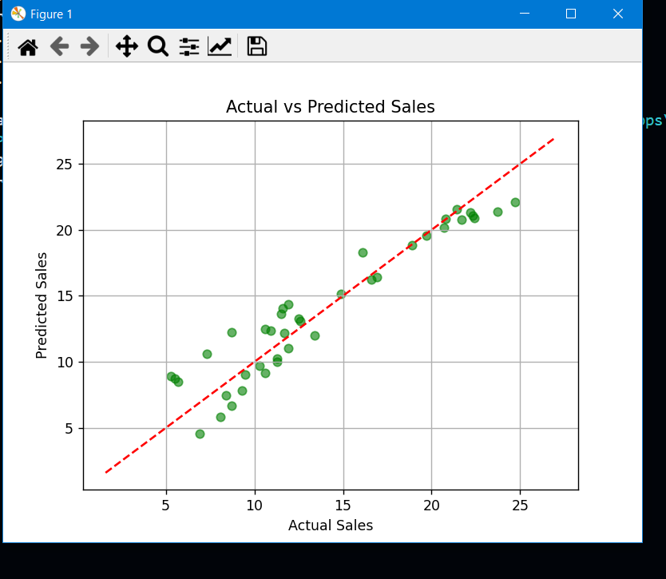
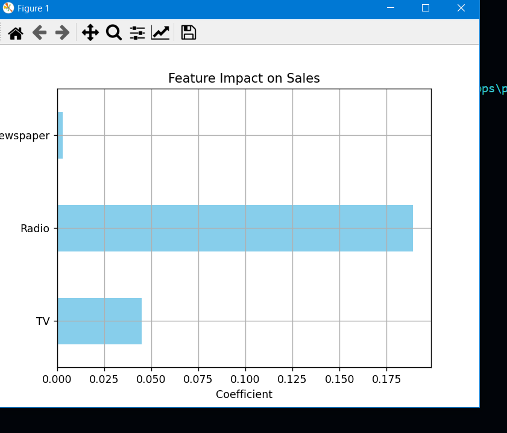

# 📈 Sales Prediction using Python - ML Project

## ✅ Task Overview

**TASK 4: Sales Prediction using Python**

This project aims to build a machine learning model that predicts future sales using advertising budget, customer segments, and marketing platforms. The insights derived from this project can guide business marketing strategies and improve decision-making.

---

## 📊 Features

- Predicts future sales using regression or time series models.
- Data cleaning, preprocessing, and feature selection included.
- Analyzes how changes in ad spending affect revenue.
- Business-oriented visualizations and insights.
- Evaluation of model using:
  - **R² Score**
  - **Mean Squared Error (MSE)**
  - Feature importance analysis

---

## 🧠 Machine Learning Concepts Covered

- Supervised learning (regression)
- Multivariate data analysis
- Feature engineering
- Predictive modeling
- Business intelligence

---

---

## 🛠️ Libraries Used

- `pandas`
- `numpy`
- `matplotlib`
- `seaborn`
- `scikit-learn`

---

## 🔎 Dataset Features

Sample dataset columns may include:

- TV Advertising Spend
- Radio Advertising Spend
- Newspaper Advertising Spend
- Sales (Target Variable)

---
✍️ Author
Muhammad Yasir
🌍 Pakistan
📧 [yaisikhan111@gmail.com]

📌 How to Run
Clone this repository:

bash
git clone https://github.com/your-username/CodeAlpha_sales-prediction-python.git

